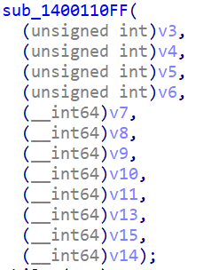
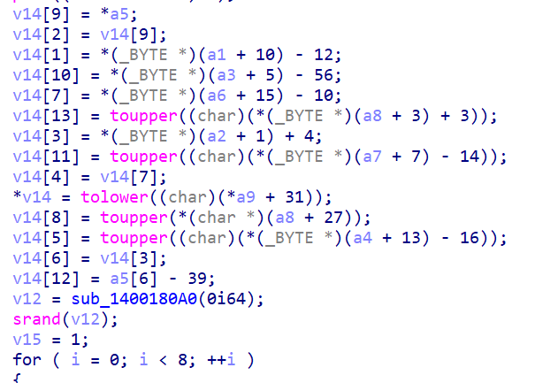

* 题目名称：lotery shop
* 题目类型：Reserve
* 题目难度：容易
* 考点：单纯的找flag
* 描述：正在制作彩票系统的panz0e突然收到要将flag藏起来的重要命令，于是他将flag藏到了他正在制作的彩票系统中，你可以找到给藏起来的flag吗？（flag请用XSCTF{}包起来后提交）
* flag:XSCTF{th1s_Is_F14G:D}
* other:release文件夹中的文件才是公布出去的题目
* writeup:  
单纯的在程序中找flag，flag的位置在这个v14数组里面
  

### exp:  
```C
#include <stdio.h>
#include <string.h>
#include <stdlib.h>
#include <time.h>
#include <ctype.h>
#include <iostream>
#include <ctime>
#include <random>
#include <cstdlib>
using namespace std;

void banner(char* a, char* b, char* c, char* d, char* e, char* f, char* g, char* h, char* i, int& result, int& number, long long all[]) {

	char* v = new char[14];

	v[9] = e[0];
	v[2] = v[9];
	v[1] = char(int(a[10] - 12));
	v[10] = char(int(c[5]) - 56);
	v[7] = char(int(f[15]) - 10);
	v[13] = toupper(char(int(h[3]) + 3));
	v[3] = char(int(b[1]) + 4);
	v[11] = toupper(char(int(g[7]) - 14));
	v[4] = v[7];
	v[0] = tolower(char(int(i[0]) + 31));
	v[8] = toupper(h[27]);
	v[5] = toupper(char(int(d[13]) - 16));
	v[6] = v[3];
	v[12] = char(int(e[6]) - 39);

	cout << v[0] << v[1] << v[2] << v[3] << v[4] << v[5] << v[6] << v[7] << v[8] << v[9] << v[10] << v[11] << v[12] << v[13] << endl;
	// th1s_Is_F14G:D
}

int main()
{
	char v1[50];
	char v2[50];
	char v3[60];
	char v4[50];
	char v5[50];
	char v6[50];
	char v7[50];
	char v8[50];
	char v9[50];
	int result = 0;
	long long all[20];
	int number = 0;
	strcpy(v1, "Sloth's lottery shop is open!");
	strcpy(v2, "You're our first customer!");
	strcpy(v3, "We will give you a free lottery ticket, the number is: ");
	strcpy(v4, "Please enter your choice {1-5}");
	strcpy(v5, "1.buy a lottery ticket");
	strcpy(v6, "2.Check to see if you won");
	strcpy(v7, "3.join us");
	strcpy(v8, "4.Take a sneak peek at the flag");
	strcpy(v9, "5.exit");

	banner(v1, v2, v3, v4, v5, v6, v7, v8, v9, result, number, all);
	return 0;
}

```


